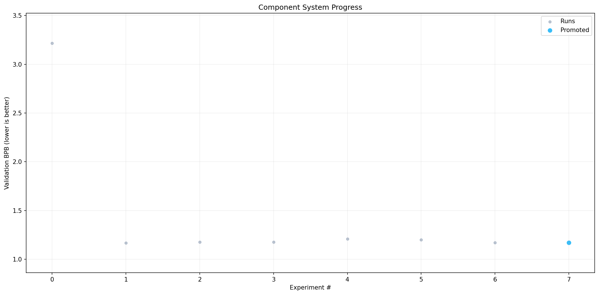

# autoresearch



*One day, frontier AI research used to be done by meat computers in between eating, sleeping, having other fun, and synchronizing once in a while using sound wave interconnect in the ritual of "group meeting". That era is long gone. Research is now entirely the domain of autonomous swarms of AI agents running across compute cluster megastructures in the skies. The agents claim that we are now in the 10,205th generation of the code base, in any case no one could tell if that's right or wrong as the "code" is now a self-modifying binary that has grown beyond human comprehension. This repo is the story of how it all began. -@karpathy, March 2026*.

Give an AI agent a small but real LLM training setup and let it experiment autonomously overnight. It modifies code, trains for 5 minutes, checks if the result improved, keeps or discards, and repeats. You wake up to a log of experiments and (hopefully) a better model.

This fork adds `scripts/agent.py`  -  a standalone autonomous agent with a Rich TUI dashboard, GPU thermal management, crash recovery, and auto-push to GitHub.

## Quick start

**Requirements:** NVIDIA GPU, WSL2 (Ubuntu), Python 3.10+

```bash
git clone https://github.com/bmdhodl/fullautoresearch.git
cd autoresearch
bash scripts/setup.sh
```

The interactive setup prompts for your Anthropic API key, dataset choice, and data directory. Then:

```bash
uv run scripts/agent.py
```

For overnight runs, keep your PC awake with `python scripts/keep_awake.py` in a separate Windows terminal.

## How it works

1. Agent asks Claude Sonnet 4.6 to propose a code change to `train.py`
2. Applies the change, validates syntax, commits it, runs training for 5 minutes
3. If val_bpb improves → keep and push. If not → revert.
4. Repeat. All results logged to `agent_results.tsv`.

The agent sends the full experiment history to the LLM each round, with categorized summaries, near-miss highlighting, and known-good techniques from community research to guide proposals.

## Project structure

```
train.py               -  model + optimizer + training loop (agent modifies this)
prepare.py             -  data prep + evaluation utilities (read-only)
program.md             -  original agent instructions (for Claude Code sessions)
scripts/
  agent.py             -  autonomous research agent with dashboard
  setup.sh             -  interactive one-command install script
  keep_awake.py        -  prevents Windows from sleeping during runs
  dashboard.py         -  standalone dashboard wrapper
  run_forever.sh       -  auto-restart wrapper for overnight runs
pyproject.toml         -  dependencies
```

## Agent features

- **Rich TUI dashboard**  -  live training metrics, GPU stats, experiment history, model output
- **GPU auto-detection**  -  scales model depth, batch size, and VRAM limits to your hardware
- **GPU thermal management**  -  pauses if GPU overheats, cools between experiments
- **Crash recovery**  -  logs state to disk, resumes cleanly after crashes or reboots
- **Smart experiment history**  -  categorized summaries, near-miss detection, known-good techniques
- **Adaptive creativity**  -  increases LLM temperature after consecutive failures
- **Parallel cooling + thinking**  -  calls LLM while GPU cools, saving ~45s per experiment
- **Per-dataset isolation**  -  separate results, logs, and state files per dataset
- **Auto-push**  -  pushes kept improvements to GitHub automatically
- **15-minute hard timeout**  -  kills hung training runs (e.g. from PC sleep)
- **Sample text generation**  -  generates and logs 100-token samples after each experiment
- **Result archiving**  -  previous results/logs are archived when starting a new experiment series with `--tag`

## Agent usage

```bash
uv run scripts/agent.py                  # full dashboard mode
uv run scripts/agent.py --resume         # continue from prior experiments
uv run scripts/agent.py --max-runs 50    # cap total experiments
uv run scripts/agent.py --dataset pubmed # train on PubMed medical abstracts
uv run scripts/agent.py --no-dashboard   # text-only mode
uv run scripts/agent.py --local          # use local LM Studio instead of Claude
uv run scripts/agent.py --tag mar21      # start new experiment series (archives old results)
```

## Custom datasets

Train on PubMed medical abstracts (27.7M abstracts, ~14.6GB download):

```bash
# Setup handles everything  -  just pick "pubmed" when prompted:
bash scripts/setup.sh

# Or non-interactive:
bash scripts/setup.sh --api-key sk-ant-... --dataset pubmed --data-dir /mnt/k/autoresearch-data

# Then run:
uv run scripts/agent.py --dataset pubmed
```

## GPU auto-detection

`train.py` auto-detects your GPU via pynvml and scales the model accordingly:

| VRAM  | Depth | Batch Size | Examples                          |
|-------|-------|------------|-----------------------------------|
| 8GB   | 8     | 8          | RTX 3070, 3060 8GB                |
| 12GB  | 10    | 8          | RTX 4070, 3060 12GB               |
| 16GB  | 12    | 16         | RTX 5070 Ti, 4080, RTX 5080       |
| 24GB+ | 16    | 32         | RTX 4090, RTX 5090, A5000         |

Override with env vars if needed: `AUTORESEARCH_DEPTH`, `AUTORESEARCH_BATCH_SIZE`, `AUTORESEARCH_VRAM_LIMIT`.

## Setup script

`scripts/setup.sh` is interactive by default  -  it prompts for everything:

```
bash scripts/setup.sh              # interactive (prompts for key, dataset, data dir)
bash scripts/setup.sh --auto       # skip prompts, use defaults + env vars
```

It handles: system deps, uv, Python packages, data download, git credentials, and persistent env vars.

Flags for scripted/CI use: `--api-key`, `--dataset`, `--data-dir`, `--auto`.

## Experiment results

### Sonnet 4 vs Sonnet 4.6 comparison (RTX 5070 Ti, PubMed dataset)

| Metric | Sonnet 4 | Sonnet 4.6 |
|---|---|---|
| Total experiments | 147 | 104 |
| Kept improvements | 5 (5.2%) | **21 (22.1%)** |
| Crash rate | 34.0% | **8.7%** |
| Improvement from baseline | 1.25% | **23.24%** |
| Best val_bpb | 0.936221 | 0.955865 |

Sonnet 4.6 produced **4x more improvements** with **4x fewer crashes** in fewer total experiments. Key wins from 4.6: halved batch size for 2x more optimizer steps, RoPE base frequency tuning, per-group Adam epsilon/beta optimization, cosine gradient clip scheduling, and weight decay floor during warmdown.

Note: different baselines (Sonnet 4 started from prior improvements at 0.948, Sonnet 4.6 started from clean master at 1.245), so absolute val_bpb is not directly comparable. The keep rate and crash rate are the meaningful metrics.

## Design choices

- **Single file to modify.** The agent only touches `train.py`.
- **Fixed 5-minute time budget.** Makes experiments comparable regardless of architecture changes.
- **Self-contained.** One GPU, one file, one metric (val_bpb  -  lower is better).

## GPU compatibility

| Architecture | GPUs | Attention backend | Status |
|---|---|---|---|
| Ampere (SM 8x) | RTX 3060/3070/3080/3090, A4000/A5000 | flash-attn3 | Fully supported |
| Ada Lovelace (SM 89) | RTX 4060/4070/4080/4090 | flash-attn3 | Fully supported |
| Hopper (SM 90) | H100, H200 | flash-attn3 (native) | Fully supported |
| Blackwell (SM 12.0) | RTX 5070 Ti, 5080, 5090 | PyTorch SDPA fallback | Supported |

**Blackwell GPUs (RTX 50-series):** Flash-attention 3 does not yet ship prebuilt kernels for SM 12.0 (Blackwell). The training script automatically detects this and falls back to PyTorch's built-in `scaled_dot_product_attention` (SDPA). Performance is slightly lower than flash-attn3 but functionally identical. When flash-attn3 adds Blackwell support, the fallback will no longer activate.

**Windows native:** Running directly on Windows (without WSL) uses SDPA and disables `torch.compile`. This works but is significantly slower. WSL2 is strongly recommended.

## Hardware safety

Training an LLM at full GPU utilization generates significant heat. This project includes **three layers of hardware protection** to prevent damage:

### Layer 1: train.py (per-step guardrails)
Every few training steps, `train.py` checks GPU temperature and VRAM:
- **Thermal pause** at 80C - training pauses and waits for the GPU to cool to 72C
- **Thermal abort** at 90C - training aborts immediately to protect hardware
- **VRAM limit** - configurable via AUTORESEARCH_VRAM_LIMIT env var (defaults to total GPU VRAM)

### Layer 2: agent.py (between-experiment guardrails)
The agent checks GPU temperature before starting each experiment:
- **Cool-start threshold** at 70C - waits up to 5 minutes for the GPU to cool before starting
- **Abort threshold** at 85C - stops the agent entirely if the GPU cannot cool down
- **15-minute hard timeout** - kills any training run that hangs (e.g. from PC sleep)

### Layer 3: dashboard (real-time monitoring)
Both the agent dashboard and standalone dashboard show live GPU stats:
- Temperature with color-coded warnings (green/yellow/red)
- VRAM usage bar with limit indicator
- GPU utilization
- Will terminate the training process if temperature hits the abort threshold

### Customizing thresholds

If your GPU runs hot or you want more conservative limits, edit the constants at the top of `train.py`:

```python
GPU_TEMP_PAUSE = 80       # pause training at this temp (C)
GPU_TEMP_ABORT = 90       # abort training at this temp (C)
GPU_TEMP_RESUME = 72      # resume after cooling to this temp (C)
```

And in `scripts/agent.py`:

```python
GPU_TEMP_MAX_START = 70   # wait for GPU to cool below this before starting
GPU_TEMP_ABORT = 85       # stop agent if GPU can't cool down
```

## Cost tracking (optional)

The agent supports [AgentGuard47](https://agentguard47.com) for API cost tracking and budget enforcement. This is optional - the agent works fine without it.

To enable:

```bash
pip install agentguard47
export AGENTGUARD_API_KEY="your_key_here"  # get one at agentguard47.com
```

When enabled, every Claude API call is automatically traced with cost, tokens, and latency. Set a budget limit to prevent runaway costs during overnight runs. View traces at your AgentGuard dashboard.

## Platform notes

Requires WSL2 on Windows for flash-attn3 / Triton / torch.compile support.

Based on [karpathy/autoresearch](https://github.com/karpathy/autoresearch).

## License

MIT
