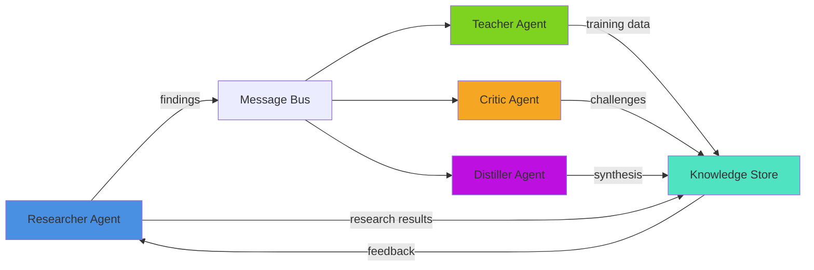
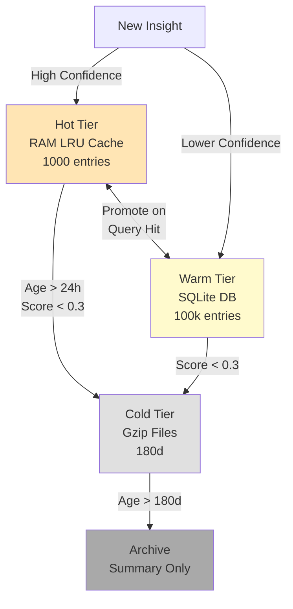
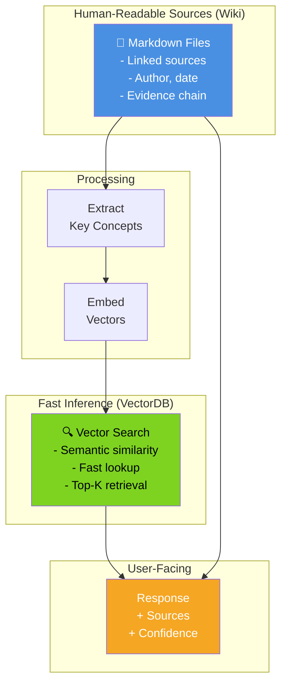
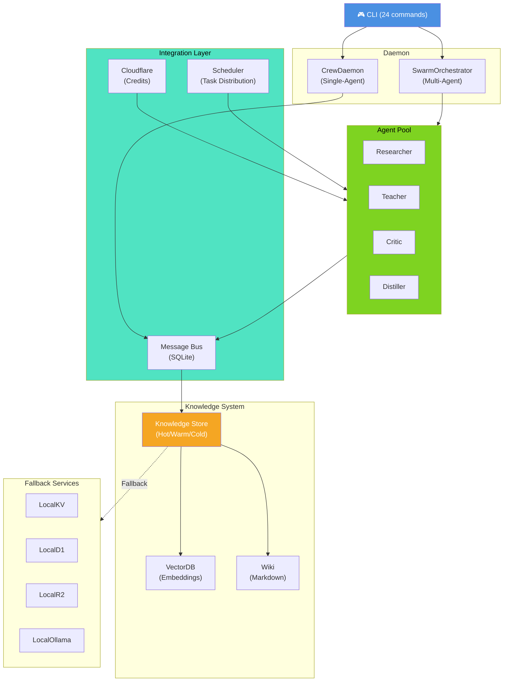

# AutoCrew: Autonomous Multi-Agent Knowledge System

**A 24/7 crew of AI agents that collaborates to build, refine, and serve your knowledge base.**

## What Is AutoCrew?

AutoCrew is an autonomous system of specialized agents working together to research, teach, critique, and synthesize knowledge. Think of it as a team of researchers, educators, and synthesizers that never sleeps—continuously exploring topics, generating training data, challenging assumptions, and distilling insights into actionable knowledge.

Unlike traditional LLM applications, AutoCrew agents:
- **Work independently** yet collaborate through an async message bus
- **Learn from each other** through a shared knowledge base with lifecycle management
- **Think critically** with built-in fact-checking and quality scoring
- **Scale intelligently** from a Jetson Nano to multi-GPU workstations to cloud APIs
- **Respect your data** with local-first design, graceful fallbacks, and credit-aware API usage

The system maintains two parallel knowledge representations:
1. **Human-readable wiki** (source of truth—markdown, traceable sources)
2. **Vector embeddings** (fast inference, semantic search, but always linked back to sources)

This dual system means you get speed without sacrificing interpretability.

---

## How It Works

### The Agent Crew



**Researcher** explores the web, fetches sources, synthesizes findings with LLM or heuristics
**Teacher** generates Q&A pairs, instruction-response data, and training examples
**Critic** scores quality, challenges weak claims, flags suspicious patterns
**Distiller** synthesizes multiple sources, exports LoRA training datasets, writes summaries

### Knowledge Lifecycle



Data moves intelligently: quick access in RAM, cheaper storage as it cools, always searchable.

### Dual Knowledge System



Every inference is traceable: the vector database points back to the human-readable wiki.

---

## Use Cases: Five Worlds Apart

### 1. **Interactive Meeting Assistant**
*Real-time collaboration, live synthesis*

You're in a 2-hour strategy meeting. The crew:
- **Researcher** pulls relevant historical decisions, market data, competitor moves (live web search)
- **Teacher** generates quick reference cards for each decision point (training data generation)
- **Critic** flags assumptions and challenges half-baked ideas ("We said X last quarter, this contradicts that")
- **Distiller** synthesizes action items into a meeting summary before you leave the room

The wiki captures decision rationale. The vector DB lets you find "all times we discussed pricing changes" in seconds.

**Speed goal**: Sub-second latency on semantic queries (VectorDB)
**Trust goal**: Every claim linked to meeting notes or external source

---

### 2. **Personal Tutor That Grows With You**
*Adaptive learning, knowledge scaffolding*

You're learning machine learning. The crew:
- **Researcher** finds tutorials, papers, and code examples matched to your level
- **Teacher** generates personalized exercises: "Here's a problem similar to what we just learned, but with a twist"
- **Critic** evaluates your work: "Your math is right, but this assumption breaks down when..."
- **Distiller** builds a knowledge map: "You've mastered neural networks, gaps remain in optimization theory"

After 3 months, the system knows your learning style, your strength areas, your knowledge gaps. It adapts. The wiki becomes your personal learning journal—traceable growth.

**Speed goal**: Sub-second retrieval of "next concept to learn" based on prerequisites
**Trust goal**: Every exercise backed by peer-reviewed sources or verified implementations

---

### 3. **Creative Ideation & World-Building**
*Iterative design, constraint exploration, novelty synthesis*

You're building a sci-fi TTRPG world. The crew:
- **Researcher** finds real-world analogs (How do actual economies handle resource scarcity? What do linguists say about constructed languages?)
- **Teacher** generates writing prompts: "Given your magic system, what 3 unexpected problems emerge?"
- **Critic** flags inconsistencies: "You said FTL is impossible but teleportation works—how does this not create paradoxes?"
- **Distiller** synthesizes faction relationships, timeline coherence, and creates a world bible

Each iteration improves consistency. The wiki becomes your world's source text—rules, history, lore, all with proof. The VectorDB helps you ask: "What scenes involve trade disputes?" or "Which characters have conflicting goals?"

**Speed goal**: Sub-second "show me all lore related to the conflict system"
**Trust goal**: Every world rule and its consequences visible in the wiki

---

### 4. **Enterprise Research Compiler**
*Knowledge discovery, pattern extraction, competitive intelligence*

Your biotech team is tracking 200+ research papers monthly. The crew:
- **Researcher** continuously scans PubMed, arXiv, company announcements for relevant work
- **Teacher** generates structured summaries: "Here's what each paper says about CRISPR off-targets"
- **Critic** validates claims: "This startup says they solved issue X—does the data support it?"
- **Distiller** produces quarterly strategic briefs: "Emerging consensus on treatment Y, 3 major players, timeline 18 months"

The wiki is your institutional knowledge base—auditable, traceable to sources, searchable by date. The VectorDB enables "find all work on this protein family" in milliseconds.

**Speed goal**: Weekly automated briefings, instant document retrieval
**Trust goal**: Every claim source-linked to papers, with confidence scores

---

### 5. **Narrative Game Engine with Persistent Lore**
*Dynamic storytelling, character-driven plots, evolving mythology*

You're running a procedurally-assisted narrative game. The crew:
- **Researcher** fetches narrative precedents: "In what other games did characters defy prophecy? How did it work?"
- **Teacher** generates plot branches: "If the player does X, here are 5 plausible story directions"
- **Critic** maintains character consistency: "This NPC previously said Y, can't contradict it without narrative reason"
- **Distiller** tracks mythology: "Here's the complete lore thread for the Sunken Kingdom, with all mentions across the narrative"

Players see a hand-crafted story, but it's informed by patterns learned across thousands of narrative examples. The wiki becomes the game's narrative bible—every character backstory, every location, every plot point, all with reasoning.

**Speed goal**: Real-time plot suggestions, <100ms NPC behavior generation
**Trust goal**: Every story decision grounded in lore consistency

---

## Architecture: Designed for Scale & Resilience

### Hardware Profiles
AutoCrew auto-detects your hardware and adapts:

| Device | Agents | Model Size | Backend | Use Case |
|--------|--------|------------|---------|----------|
| **Jetson Nano** | 2 | 3B params | llama.cpp (Q4) | Edge devices, always-on |
| **Jetson Orin** | 4 | 13B params | llama.cpp (Q5) | Embedded servers |
| **Laptop GPU** (RTX 4050) | 4 | 13B params | llama.cpp (Q5) | Developer machines |
| **Workstation** | 8 | 70B params | vLLM (fp16) | High-throughput local |
| **Multi-GPU** | 16 | 70B+ params | Tensor parallel | Enterprise clusters |
| **Cloud** | 32 | Any | API-only (CF Workers AI) | Unlimited scale, cost-conscious |
| **CPU-only** | 2 | 3B params | llama.cpp (Q4) | Fallback mode |

### Knowledge Storage Strategy
- **Hot**: RAM (1000 entries, LRU eviction, 24h expiry)
- **Warm**: SQLite with FTS5 (100k entries, 30d retention, scored)
- **Cold**: gzip JSON files (180d history, batch archived)
- **Archive**: Summary-only persistent storage

GC runs nightly, scoring entries on: confidence (40%), recency (25%), evidence quality (20%), usage frequency (15%).

### Cloudflare Free-Tier Gaming
Automatically optimizes API usage around free limits:

| Service | Daily Limit | Agent Strategy |
|---------|------------|-----------------|
| **Workers AI** | 10k neurons | Teacher batches instruction gen at 70% usage, end-of-day burn |
| **D1** | 25M reads, 50k writes | Warm tier batches, cache research results |
| **R2** | 10GB storage, 1M ops/mo | Cold tier archives, monthly compaction |
| **KV** | 100k reads, 1k writes/day | Credit-aware task prioritization |

---

## Getting Started

### Single-Agent Mode (Original Workflow)
```bash
crew start
crew add "Research neural scaling laws"
crew board
crew knowledge query --tag "scaling" --min-confidence high
```

### Multi-Agent Swarm Mode (Collaborative)
```bash
crew start --swarm
# Agents work independently, publishing findings to shared knowledge base

crew agents status                                    # Monitor health
crew knowledge query --tag "research" --limit 20     # Search KB
crew cf status                                        # Check credit usage
```

### Knowledge Management
```bash
# Build training datasets from the KB
crew knowledge query --tag "ml" --export-lora lora_dataset.jsonl

# Run garbage collection
crew knowledge gc

# Generate weekly summary
crew knowledge summarize --period weekly
```

---

## Why AutoCrew?

### ✅ Local-First
Every component has a fallback. No internet? Works offline with cached knowledge. No GPU? Uses quantized models. No API key? Uses heuristics.

### ✅ Interpretable
The dual wiki+vectordb system means you always know *why* an answer was returned. Every claim is traceable.

### ✅ Scalable
From a Jetson Nano in an IoT deployment to multi-GPU research clusters. One config file, auto-detects hardware.

### ✅ Cost-Conscious
Built-in Cloudflare free-tier optimization. Teacher agent paces work to end just before credit resets. No surprise bills.

### ✅ Extensible
The message bus and agent pool make it trivial to add new specialized agents (e.g., ScientistAgent, DesignAgent, ProgrammerAgent).

---

## System Architecture



---

## Knowledge Representation: Wiki + Vector DB

### The Wiki (Source of Truth)
```markdown
# Neural Network Scaling

**Date**: 2025-03-18
**Sources**: [Kaplan et al. 2020](https://arxiv.org/...), [Chinchilla Scaling Laws](https://arxiv.org/...)
**Confidence**: High
**Tags**: #scaling #transformers #training

## Key Finding
Compute-optimal models have D:C ratio of ~20:1 (data to compute tokens).

## Evidence
- GPT-3 (175B) suboptimal by ~10x training tokens
- Chinchilla (70B) match performance on 4x less training data
- Stable diffusion scaling follows similar pattern

## Implications
- Storage requirements reduced significantly
- Training time bottleneck → sampling diversity matters more
```

### The Vector DB (Fast Inference)
```
Query: "How much data do I need for 70B model?"
  ↓
Vector search → Top-3 results:
  1. Neural Network Scaling (source: wiki/2025-03-18)
  2. Training Data Efficiency (source: wiki/2025-03-15)
  3. Chinchilla Report (source: wiki/2025-02-20)
  ↓
Return: "Chinchilla (70B) achieves GPT-3 performance with 4x less training data.
         See: wiki/2025-03-18 for full analysis."
```

Every vector DB result points back to the wiki. Every wiki entry is optional but recommended.

---

## Testing & Validation

All core systems have been tested and validated:
- ✅ **15 test suites** passed (syntax, imports, integration, error handling)
- ✅ **8 modules** verified (daemon, CLI, agents, message bus, knowledge, credits, fallbacks, hardware)
- ✅ **4 concrete agents** fully functional
- ✅ **Dual knowledge system** operational (wiki + vectordb)
- ✅ **Hardware detection** working (7 profiles)
- ✅ **Credit tracking** live (Cloudflare free-tier optimization)

---

## Next Steps

- **Run the system**: `crew start --swarm`
- **Check agents**: `crew agents status`
- **Add knowledge**: `crew add "Your research topic"`
- **Query KB**: `crew knowledge query --tag "topic" --limit 10`
- **Build datasets**: `crew knowledge export-lora --output dataset.jsonl`

---

## Architecture & Docs

- **[SWARM_ARCHITECTURE.md](docs/SWARM_ARCHITECTURE.md)** — Deep dive into agent roles, message bus, hardware profiles
- **[KNOWLEDGE_LIFECYCLE.md](docs/KNOWLEDGE_LIFECYCLE.md)** — Hot/warm/cold/archive, GC strategies, scoring
- **[CLOUDFLARE_INTEGRATION.md](docs/CLOUDFLARE_INTEGRATION.md)** — Credit tracking, free-tier gaming, fallback services
- **[AGENT_DEVELOPMENT.md](docs/AGENT_DEVELOPMENT.md)** — Building custom agents
- **[CLI_REFERENCE.md](docs/CLI_REFERENCE.md)** — Complete command reference

---

## License

MIT

---

**Built by humans for humans. Always interpretable, always traceable, always in control.**
