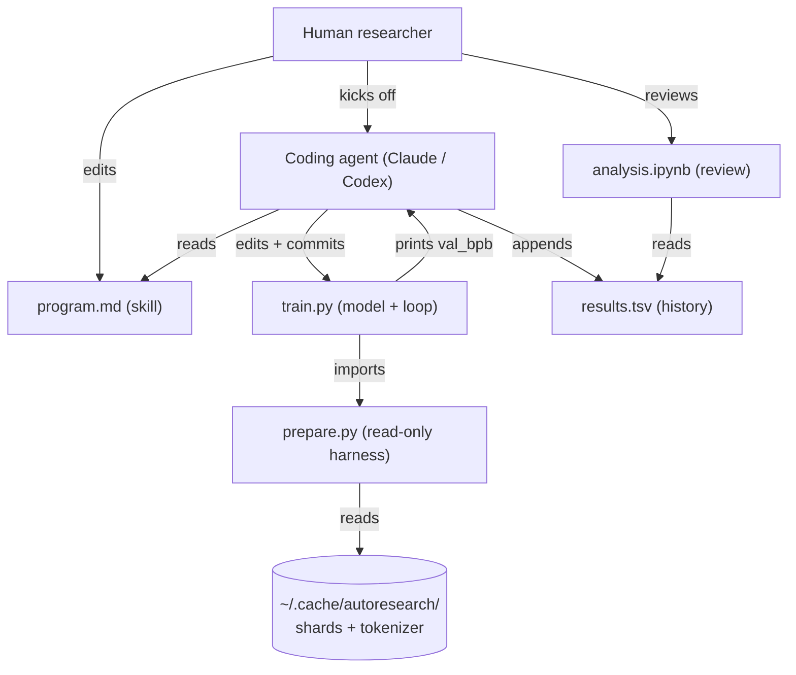
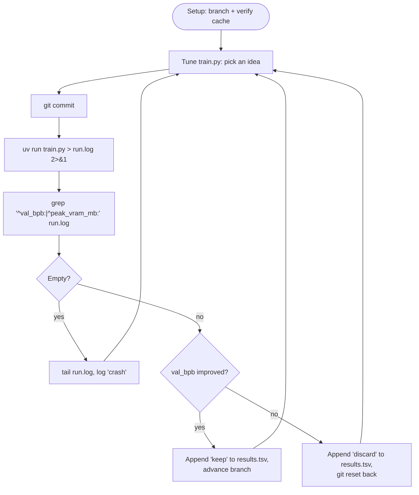
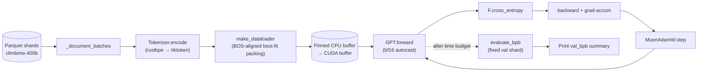

# Architecture

Autoresearch turns a small, self-contained LLM training setup into an autonomous research target. A coding agent (Claude / Codex / similar) edits a single file, runs a fixed-budget training script, reads a single metric, and either keeps the change or reverts. The repository's role is to define the *experiment harness* so the agent's actions are comparable, reversible, and persistent.

This page explains the moving parts and how they interact. Reference pages cover exact interfaces.

## High-level system



Three roles, three contracts:

- **Human** writes `program.md` and chooses the agent. Never edits `train.py` once the run starts.
- **Agent** mutates `train.py`, commits, runs `uv run train.py`, decides keep/discard.
- **Harness** (`prepare.py`) provides constants, dataloader, and the canonical `evaluate_bpb` metric. Read-only by contract.

The `~/.cache/autoresearch/` directory is one-time setup. After `prepare.py` runs once, the data shards and tokenizer are reused across every experiment.

## The experiment loop

The agent's behavior is specified in [`program.md`](../program.md). It runs forever, advancing or rewinding a dedicated branch (`autoresearch/<tag>`).



Key contract: **state is in git, not in memory**. Every experiment is a commit; reverting is `git reset`. The `results.tsv` file is a parallel log that survives resets because it is left untracked (see `.gitignore`).

The 5-minute training budget is enforced by `train.py` itself using `TIME_BUDGET` from `prepare.py`. Compilation and warmup steps don't count — the timer starts after step 10.

## Training pipeline

Inside one experiment run, the data path is fixed and the model + optimizer are mutable.



What is fixed and what is fair game:

| Layer | Fixed (do not edit) | Mutable (agent edits) |
|---|---|---|
| Data | shard list, val shard, `MAX_SEQ_LEN`, `EVAL_TOKENS` | none |
| Tokenizer | `VOCAB_SIZE`, BPE merges, special tokens | none |
| Dataloader | BOS-aligned best-fit packing in `prepare.py` | `DEVICE_BATCH_SIZE` (called as `B`) |
| Model | `GPT.forward` is *defined* in train.py | every architectural detail |
| Optimizer | `MuonAdamW` algorithm is in train.py | every hyperparameter, even the optimizer itself |
| Eval | `evaluate_bpb` and val shard `shard_06542` | none |
| Time | `TIME_BUDGET = 300s` | none |

The simplicity criterion: a small win that adds significant complexity is worse than a slightly smaller win that is clean. See [`program.md`](../program.md) for the full keep/discard rubric.

## File layout

```
autoresearch/
├── README.md            # human-facing overview
├── program.md           # agent skill: setup + experiment loop
├── prepare.py           # constants, data prep, dataloader, evaluate_bpb (read-only contract)
├── train.py             # model, optimizer, training loop (the only file the agent edits)
├── analysis.ipynb       # plot results.tsv → progress.png
├── progress.png         # teaser image (regenerated by the notebook)
├── pyproject.toml       # dependencies + cu128 PyTorch index
├── docs/                # this documentation set
├── llms.txt             # concise LLM index
├── llms-full.txt        # bundled docs for ingestion
└── CHANGELOG.md         # append-only history
```

Untracked, runtime-only:

```
~/.cache/autoresearch/
├── data/shard_*.parquet     # downloaded once
└── tokenizer/
    ├── tokenizer.pkl        # tiktoken encoding (pickled)
    └── token_bytes.pt       # per-token-id byte length, used by evaluate_bpb

results.tsv                  # per-experiment log, never committed
run.log                      # last run's stdout + stderr
```

## Why these design choices

- **One file to edit.** Diffs are small and reviewable. The agent can't accidentally change the metric.
- **Fixed wall-clock budget.** The agent can't game the metric by training longer. Cross-experiment comparisons are valid.
- **BPB instead of cross-entropy.** Bits-per-byte is vocab-size-independent; the agent could change the tokenizer (in principle) without making old runs incomparable. (`VOCAB_SIZE` is currently fixed by the harness, but BPB keeps the door open.)
- **Pinned validation shard.** `shard_06542.parquet` is held out from training in `_document_batches` and `text_iterator`. Always the same val set, every experiment.
- **Single GPU, single file, single metric.** Scope is the discipline; see the `prepare.py` constants block.

Cross-references:

- Setup and first run → [getting-started.md](getting-started.md)
- Agent loop semantics → [agent-workflow.md](agent-workflow.md)
- `prepare.py` API → [reference/prepare.md](reference/prepare.md)
- `train.py` knobs → [reference/train.md](reference/train.md)
- Model details → [internals/model.md](internals/model.md)
- Optimizer details → [internals/optimizer.md](internals/optimizer.md)
