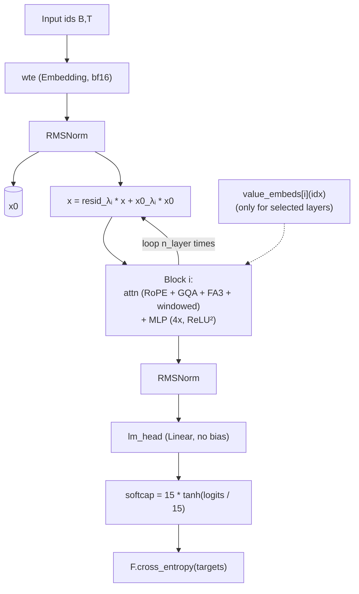
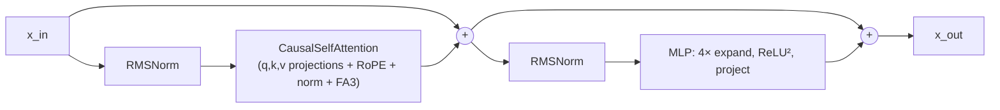

# Internals: GPT model

This page explains *what* the modules in `train.py` do, beyond the bare API listing in [reference/train.md](../reference/train.md). The model is a decoder-only transformer with a few non-standard pieces: alternating sliding-window attention, value embeddings (ResFormer-style), per-layer mixing scalars (`resid_lambdas`, `x0_lambdas`), and softcapped logits.

## Overall data flow



A few features that distinguish it from a vanilla GPT:

- **`x0_lambdas`** lets every layer mix in the original token embedding (`x0`). The default initial value is `0.1`, so each layer starts with a small re-injection of the first-layer signal.
- **`resid_lambdas`** scales the running residual. Default initial value `1.0`.
- **Value embeddings** (`value_embeds`) are a separate `Embedding` table per *selected* layer, contributing directly to attention `V`. Selection rule: `has_ve(i, n_layer)` — alternating layers with the last layer always included.
- **Sliding window attention** alternates short (`MAX_SEQ_LEN/2`) and long (`MAX_SEQ_LEN`) layers per the `WINDOW_PATTERN`. The last layer is always full.
- **Logit softcap** at 15 (`15 * tanh(logits / 15)`) keeps logit magnitudes bounded.

## Block layout



Pre-norm structure: norm before attention, norm before MLP, residual adds outside the norm. Both `c_proj` weights are zero-initialized so each block starts as the identity, easing initialization.

## Attention

Implementation is in `CausalSelfAttention.forward`. Key features:

```python
q = self.c_q(x).view(B, T, n_head, head_dim)
k = self.c_k(x).view(B, T, n_kv_head, head_dim)
v = self.c_v(x).view(B, T, n_kv_head, head_dim)

if ve is not None:
    ve = ve.view(B, T, n_kv_head, head_dim)
    gate = 2 * sigmoid(ve_gate(x[..., :32]))   # per-head gate from first 32 channels of x
    v = v + gate.unsqueeze(-1) * ve

q, k = apply_rotary_emb(q, cos, sin), apply_rotary_emb(k, cos, sin)
q, k = norm(q), norm(k)                         # QK-norm

y = fa3.flash_attn_func(q, k, v, causal=True, window_size=window_size)
y = c_proj(y.contiguous().view(B, T, -1))
```

| Feature | Notes |
|---|---|
| **GQA-ready** | `n_kv_head` defaults to `n_head` (no GQA). Setting `n_kv_head < n_head` enables grouped-query attention; the asserts require `n_head % n_kv_head == 0`. |
| **RoPE** | `apply_rotary_emb` rotates the first half of head channels against the second half. `cos`/`sin` are precomputed for `sequence_len * 10` so the model has headroom to extrapolate. |
| **QK-norm** | Plain RMS norm on Q and K before attention — stabilizes training, especially under bf16. |
| **Flash Attention 3** | `kernels.get_kernel(...)` fetches a kernel package keyed by GPU capability. `window_size` is `(left, right)`; the model passes `(window, 0)` (causal). |
| **Value residual (ResFormer)** | Selected layers add a value-embedding contribution to `V`. The gate is `2 * sigmoid(W_g * x[:, :, :32])` so it lives in `(0, 2)` and starts at `1.0` when `W_g` is zero-initialized. |

`window_size` per layer comes from `_compute_window_sizes`:

```python
char_to_window = {"L": (long_window, 0), "S": (short_window, 0)}
window_sizes = [char_to_window[pattern[i % len(pattern)]] for i in range(n_layer)]
window_sizes[-1] = (long_window, 0)   # last layer always full
```

With `WINDOW_PATTERN="SSSL"` and `n_layer=8`, every fourth layer is full and the last layer is forced to full, giving `[S, S, S, L, S, S, S, L]`.

## Value embeddings

```python
def has_ve(layer_idx, n_layer):
    return layer_idx % 2 == (n_layer - 1) % 2
```

So with `n_layer=8`: VE on layers `[1, 3, 5, 7]`. The last layer always has VE. Selected layers each own a separate `Embedding(vocab_size, n_kv_head * head_dim)` table cast to bf16.

The contribution path:

1. Look up `ve = value_embeds[i](idx)` — same `idx` as the token embedding.
2. Compute a per-head gate from the first 32 channels of the layer input: `gate = 2 * sigmoid(ve_gate(x[:, :, :32]))`, shape `(B, T, n_kv_head)`.
3. Add `gate.unsqueeze(-1) * ve` to `V` before attention.

`ve_gate` is initialized to zero, so initial `gate = 1.0` everywhere — the value residual starts neutral.

## MLP

```python
class MLP:
    c_fc:   Linear(n_embd, 4*n_embd)
    c_proj: Linear(4*n_embd, n_embd)
    forward: c_proj(F.relu(c_fc(x)).square())
```

Squared-ReLU activation. Both `c_fc` and `c_proj` are zero-initialized for `c_proj` (identity start) and uniform-initialized for `c_fc`.

## Normalization

`norm(x) = F.rms_norm(x, (x.size(-1),))` — no learnable scale or bias. Used:

- After `wte` (the `x0` source).
- Before attention and MLP in each block (pre-norm).
- After the last block (final norm before `lm_head`).
- On Q and K inside attention.

## Initialization

`init_weights()` runs on a `meta` model materialized via `to_empty`:

- `wte` ~ N(0, 1).
- `lm_head` ~ N(0, 0.001) — small, so initial logits are nearly zero.
- All matrix params (`c_q`, `c_k`, `c_v`, `c_fc`) are uniform on `[-s, s]` with `s = sqrt(3) / sqrt(n_embd)`.
- All projection params (`c_proj`) and `ve_gate.weight` are zero. Each block starts as the identity.
- `resid_lambdas` ← 1.0, `x0_lambdas` ← 0.1.
- Each value embedding table is uniform on `[-s, s]`.
- After init, `wte` and every value embedding table are cast to `bfloat16`.

The result is a model where the first forward pass produces ~zero logits, and the optimizer immediately gets useful gradients from the cross-entropy.

## Forward pass

```python
def forward(self, idx, targets=None, reduction='mean'):
    cos_sin = self.cos[:, :T], self.sin[:, :T]

    x = self.transformer.wte(idx)
    x = norm(x)
    x0 = x

    for i, block in enumerate(self.transformer.h):
        x = self.resid_lambdas[i] * x + self.x0_lambdas[i] * x0
        ve = self.value_embeds[str(i)](idx) if str(i) in self.value_embeds else None
        x = block(x, ve, cos_sin, self.window_sizes[i])

    x = norm(x)
    logits = self.lm_head(x).float()
    logits = 15 * torch.tanh(logits / 15)

    if targets is not None:
        return F.cross_entropy(logits.view(-1, logits.size(-1)), targets.view(-1),
                                ignore_index=-1, reduction=reduction)
    return logits
```

Notes:

- `cos_sin` is sliced fresh every call. The buffer contains 10× capacity, so changing `MAX_SEQ_LEN` (don't!) is supported up to the buffer length.
- `logits.float()` lifts to fp32 *before* the softcap, so the cross-entropy is numerically clean even though the rest of the model is bf16.
- `reduction='none'` is the path used by `evaluate_bpb` to get per-token loss.

## FLOP and parameter accounting

`estimate_flops()` returns *FLOPs per token* for forward + backward:

```python
nparams_exclude = wte + value_embeds + resid_lambdas + x0_lambdas
attn_flops = sum(12 * h * q * effective_seq for window in window_sizes)
return 6 * (nparams - nparams_exclude) + attn_flops
```

The `6 *` factor is the standard 1× FWD + 2× BWD + 3× activation rule of thumb. Embeddings are excluded because they don't contribute MAC FLOPs at runtime in the same way (lookups, not matmuls). The attention term uses `effective_seq = min(window, T)` per layer to discount the savings from sliding windows.

`num_scaling_params()` returns six entries: `wte`, `value_embeds`, `lm_head`, `transformer_matrices`, `scalars`, `total`. Used for the `num_params_M` line in the run summary.

## What to try when modifying the model

This is just a starting list — the agent should think for itself.

- **Architecture**: GQA via `n_kv_head < n_head`, more or fewer VE layers (edit `has_ve`), different window patterns, different MLP expansion ratios, swap activation.
- **Mixing scalars**: try removing `x0_lambdas` entirely if it's not pulling its weight; try a learned scalar per *channel* instead of per layer.
- **Scaling**: tweak `ASPECT_RATIO`, `HEAD_DIM`, and `DEPTH` jointly. The `DEPTH * ASPECT_RATIO` rule is just a heuristic.
- **Logit softcap**: try other softcap values, or remove it.
- **Numerics**: cast more (or fewer) modules to bf16, try fp8 matmul in projections.
- **Init**: change the `s = sqrt(3)/sqrt(n_embd)` scale factor or seed.

Whatever you try, the keep/discard rule applies: if the change adds 50 lines for 0.001 bpb, discard.
