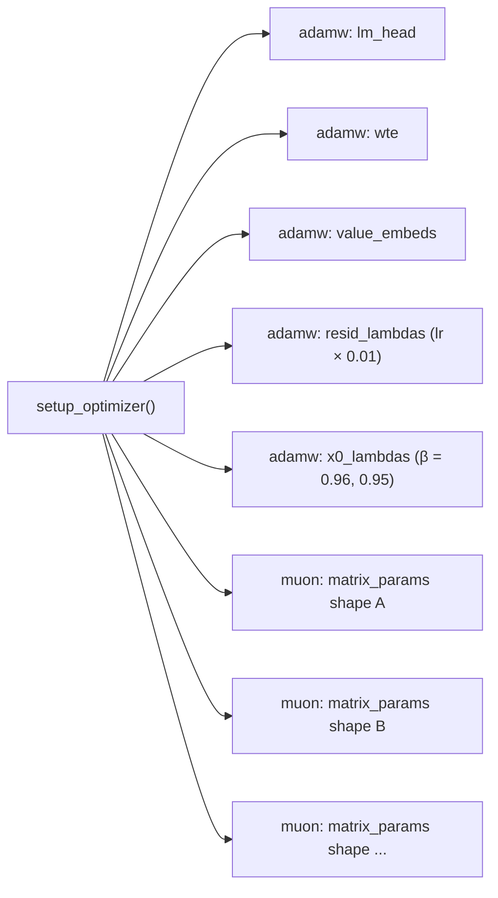
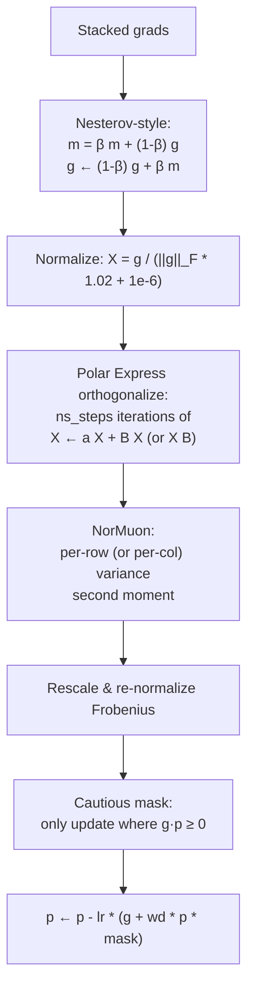

# Internals: `MuonAdamW`

`MuonAdamW` is a single optimizer that dispatches each parameter group to either AdamW or Muon depending on the `kind` field. AdamW handles embeddings, the LM head, and the per-layer scalars. Muon handles the 2-D matrices in transformer blocks.

This page explains the algorithm, the param-group split, and the schedules that wrap it.

## Param-group split

`GPT.setup_optimizer` constructs the groups:



Important details:

- AdamW LRs (`lm_head`, `wte`, `value_embeds`) are scaled by `(model_dim / 768)^-0.5`. The defaults were tuned at `model_dim = 768`.
- `x0_lambdas` uses Adam betas `(0.96, 0.95)` — slightly higher β1 than the rest, to smooth out a noisy scalar.
- Muon groups are **bucketed by parameter shape**. Every block exposes the same set of shapes (e.g., `c_q.weight`, `c_k.weight`, …), so each shape's tensors are stacked into a single batched update for vectorized `_step_muon`.
- After construction, every group's `lr` is duplicated into `initial_lr`. Schedules then write `group["lr"] = initial_lr * lrm` each step.

## AdamW step

`adamw_step_fused` is `@torch.compile(dynamic=False, fullgraph=True)`:

```python
p.mul_(1 - lr * wd)                              # decoupled weight decay
exp_avg.lerp_(grad, 1 - β1)                      # m = β1 m + (1-β1) g
exp_avg_sq.lerp_(grad.square(), 1 - β2)          # v = β2 v + (1-β2) g²
denom = (exp_avg_sq / (1 - β2**step)).sqrt() + eps
p.add_(exp_avg / denom, alpha=-lr / (1 - β1**step))
```

Bias correction is computed inline; no extra state. All hyperparameters arrive as 0-D CPU tensors (`_adamw_lr_t`, `_adamw_beta1_t`, …) so changing them between steps doesn't trigger `torch.compile` recompilation.

## Muon step

`muon_step_fused` is the more interesting one. The pipeline per stacked-shape group:



### Polar Express orthogonalization

```python
polar_express_coeffs = [
    (8.156554524902461, -22.48329292557795, 15.878769915207462),
    (4.042929935166739,  -2.808917465908714,  0.5000178451051316),
    (3.8916678022926607, -2.772484153217685,  0.5060648178503393),
    (3.285753657755655,  -2.3681294933425376, 0.46449024233003106),
    (2.3465413258596377, -1.7097828382687081, 0.42323551169305323),
]

X = g / (||g||_F * 1.02 + 1e-6)        # normalize
if g.size(-2) > g.size(-1):            # tall matrix → use X^T X
    for a, b, c in polar_express_coeffs[:ns_steps]:
        A = X.mT @ X
        B = b * A + c * (A @ A)
        X = a * X + X @ B
else:                                   # wide matrix → use X X^T
    for a, b, c in polar_express_coeffs[:ns_steps]:
        A = X @ X.mT
        B = b * A + c * (A @ A)
        X = a * X + B @ X
```

This is a Newton–Schulz-style polynomial that drives the singular values of `X` toward 1 — i.e., approximate orthogonalization of the (normalized) gradient matrix. `ns_steps=5` uses all five coefficient triples. The "tall vs wide" branch keeps the inner product on the smaller dimension for compute efficiency.

### NorMuon variance reduction

After orthogonalization, NorMuon estimates and rescales the per-row (tall) or per-column (wide) variance:

```python
v_mean = g.float().square().mean(dim=red_dim, keepdim=True)   # red_dim = -1 (tall) or -2 (wide)
v_norm_sq = v_mean.sum(...) * red_dim_size
v_norm = v_norm_sq.sqrt()
second_momentum_buffer.lerp_(v_mean, 1 - β2)
step_size = second_momentum_buffer.clamp_min(1e-10).rsqrt()
scaled_sq_sum = (v_mean * red_dim_size) * step_size.float().square()
v_norm_new = scaled_sq_sum.sum(...).sqrt()
final_scale = step_size * (v_norm / v_norm_new.clamp_min(1e-10))
g = g * final_scale
```

The result: each row (or column) gets a different effective learning rate based on its EMA of squared values, then everything is renormalized so the Frobenius norm stays consistent across rows.

### Cautious weight decay

```python
mask = (g * p) >= 0
p.sub_(lr * g + lr * wd * p * mask)
```

Weight decay only applies where `g` and `p` agree in sign (i.e., where the update would move the parameter toward zero from the gradient's direction *and* the decay is also pushing it toward zero). This prevents WD from fighting the gradient on the channels where shrinkage isn't warranted.

The Muon LR is also shape-scaled:

```python
self._muon_lr_t.fill_(group["lr"] * max(1.0, shape[-2] / shape[-1])**0.5)
```

Tall matrices get a larger LR than wide ones in the same group — compensates for the asymmetry in the orthogonalization step.

## State tensors

For each Muon shape-group:

- `momentum_buffer`: `(num_params, *shape)` — Nesterov momentum.
- `second_momentum_buffer`: `(num_params, shape[-2], 1)` if tall, else `(num_params, 1, shape[-1])` — NorMuon EMA.

For each AdamW parameter:

- `state['step']`: scalar Python int.
- `state['exp_avg']`, `state['exp_avg_sq']`: full-shape tensors.

## Schedules

Three time-based schedules wrap the optimizer, all keyed off `progress = total_training_time / TIME_BUDGET`:

```python
def get_lr_multiplier(progress):
    if progress < WARMUP_RATIO:                          # warmup
        return progress / WARMUP_RATIO if WARMUP_RATIO > 0 else 1.0
    elif progress < 1.0 - WARMDOWN_RATIO:                # plateau
        return 1.0
    else:                                                # warmdown to FINAL_LR_FRAC
        cooldown = (1.0 - progress) / WARMDOWN_RATIO
        return cooldown * 1.0 + (1 - cooldown) * FINAL_LR_FRAC

def get_muon_momentum(step):                             # 0.85 → 0.95 over first 300 steps
    frac = min(step / 300, 1)
    return (1 - frac) * 0.85 + frac * 0.95

def get_weight_decay(progress):                          # WEIGHT_DECAY → 0 linearly
    return WEIGHT_DECAY * (1 - progress)
```

Each step the loop writes:

```python
for group in optimizer.param_groups:
    group["lr"] = group["initial_lr"] * lrm
    if group["kind"] == "muon":
        group["momentum"] = muon_momentum
        group["weight_decay"] = muon_weight_decay
```

Defaults (`WARMUP_RATIO=0.0`, `WARMDOWN_RATIO=0.5`, `FINAL_LR_FRAC=0.0`) give a "no-warmup, half-the-budget cooldown to zero" trapezoid. Changing those is one of the simpler experiments.

## Why no recompilation

The compiled `_step_*` functions take 0-D CPU tensors for every numeric hyperparameter. The optimizer holds these tensors as instance attributes (`self._adamw_lr_t`, …) and uses `.fill_()` to write the current step's value. From `torch.compile`'s perspective, the *tensor identities* don't change between steps, so it doesn't recompile when LRs or β values shift mid-run.

This is what lets the schedules above be cheap.

## Surface area for experimentation

If you're modifying the optimizer:

- The polar-express coefficients and `ns_steps` are easy to swap.
- The cautious-WD mask `(g * p) >= 0` is one of several reasonable forms — `(g * p) > 0` or no mask are alternatives.
- The shape-LR scaling `max(1, h/w)^0.5` is a heuristic.
- The two AdamW betas (`(0.8, 0.95)` and `(0.96, 0.95)`) and the embedding/unembedding LR ratio are obvious knobs.
- Replacing Muon entirely (e.g., with Shampoo or plain AdamW for matrices) is a valid experiment.

The schedules in `get_lr_multiplier`, `get_muon_momentum`, and `get_weight_decay` are also fair game — they're just three plain Python functions.
