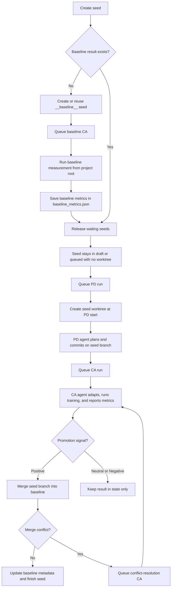

# autoresearch — PDCA-System Protocol

This document is the operating manual for the pdca-system workflow.
The system runs a continuous Seed -> PD -> CA loop to discover, generate,
adapt, evaluate, and promote improvements to the training stack.

The main objective is simple: improve the **target metric** (see `pdca_system/config.py`: `TARGET_METRIC_KEY`, default `val_bpb`) against the current baseline
without breaking the canonical training run (train.py) or introducing
unreasonable complexity.

VRAM is a first-class constraint. Higher memory use is acceptable only when the
quality gain is meaningful; avoid candidates that produce small or ambiguous
target-metric gains while causing large memory growth.

## Top-Level Bootstrap Rule

If you are an interactive code agent that was merely told to "follow this
protocol", do not manually simulate the entire workflow inside one foreground
session.

The intended control flow is:
1. Read this file and the required context files.
2. Ensure the queue and state layout exist.
3. Create or refine a seed from a human prompt.
4. Queue the seed for PD.
5. Start the daemon: `uv run pdca_system/daemon.py`.
6. Let daemon workers execute PD and CA via file-based handoff.
7. Monitor the daemon, queue, and logs; do not simulate stages in-session.

Manual execution of an individual stage is only for the agent process that was
invoked by the daemon for that specific task.

## Architecture

```text
pdca_system/
  protocol.md               <- overall workflow protocol
  PDCA-Plan-Do.md           <- PD stage rules
  PDCA-Check-Action.md      <- CA stage rules
  daemon.py                 <- resident daemon and worker dispatch
  task.py                   <- queue and JSON state helpers
  baseline_branches.json    <- per-branch baseline mapping (workflow-managed; read-only)
  baseline_metrics.json     <- baseline run metrics (workflow-managed; read-only)
  config.py                 <- promotion threshold, target metric (TARGET_METRIC_KEY, TARGET_METRIC_LOWER_IS_BETTER, TARGET_METRIC_LABEL), and static config
  history/                  <- runtime dir (auto-created)
    logs/                   <- agent stdout/stderr logs
    queue/{pd,ca,done,error}/ <- stage handoff and archival
    state/{seeds,runs,events}/<- durable workflow state
    worktrees/              <- per-seed git worktrees
```

Training runs use the project's **train.py** (at repo root). PDCA is a pure orchestrator: it drives agents to modify and run code outside pdca_system (e.g. train.py).

## Core Goal and Decision Rule

Optimize for the target metric (default: lower `val_bpb`; configurable in `config.py` via `TARGET_METRIC_KEY` and `TARGET_METRIC_LOWER_IS_BETTER`). A candidate is worth promoting only when the gain
is real, the implementation is understandable, and the cost in memory or
complexity is justified.

Apply this bias consistently:
- The target metric (e.g. lower `val_bpb`) is the primary success metric.
- VRAM is a soft but important constraint: some increase is acceptable, but
  dramatic growth needs correspondingly strong quality gains.
- Simpler changes are preferred when results are similar.
- A tiny gain that adds brittle complexity is usually not worth promotion.
- A tiny gain that materially increases VRAM is usually not worth promotion.
- A simplification that preserves or slightly improves quality is a strong outcome.
- If the signal is ambiguous, treat it as `neutral` and do not promote.

## Required Reading Before Any Work

Read in this order:
1. `pdca_system/protocol.md`
2. The stage-specific document (right after protocol): `pdca_system/PDCA-Check-Action.md` for CA, `pdca_system/PDCA-Plan-Do.md` for PD
3. `prepare.py` for fixed data and evaluation behavior; never modify it
4. `train.py` for the canonical training execution (agent modifies this file)
5. `pdca_system/config.py` for promotion threshold, target metric (`TARGET_METRIC_KEY`, `TARGET_METRIC_LOWER_IS_BETTER`, `TARGET_METRIC_LABEL`), and static config

Baseline files (workflow-managed; read-only): `baseline_branches.json`, `baseline_metrics.json`. For interactive bootstrap, inspect recent `queue/done/` and baseline state.

## Workspace and Path Rules

When the daemon invokes you for a PD or CA task, your current working directory
is the seed worktree. In that mode:

- Read and edit only within the seed worktree.
- Use only relative paths from the current working directory.
- Do not request or depend on absolute paths or files outside the worktree.

## Hard Constraints

1. Never modify `prepare.py`.
2. `uv run train.py` is the canonical training command; agents run it from the worktree.
3. The root repo stays compatible with the upstream implementation;
   training logic lives in `train.py` (edited by the agent), not inside pdca_system.
4. Stage-to-stage handoff must happen through files under `queue/`, not
   merely in memory or only in agent conversation state.
5. Only the CA promotion flow may update `baseline_metrics.json` and `baseline_branches.json`.
6. Do not bypass the baseline mechanism by manually merging branches or
   force-advancing the baseline outside workflow control.

## Baseline-First Rule

Establish baseline before evaluating seeds: if `baseline_metrics.json` has no baseline result for the branch (no records), run the baseline (no-changes) measurement first. Use that result as the reference for promotion.



## Workflow Stages

The sections below describe what each daemon-dispatched stage worker does.
They are not instructions for a top-level interactive agent to perform the
entire lifecycle manually.

### PD — Plan-Do (Discovery / Initial Generation)

Read `pdca_system/PDCA-Plan-Do.md`.

Responsibilities:
- Refine the seed prompt into a concrete plan.
- Create or refresh the seed worktree from the active baseline.
- Generate the first candidate implementation in the worktree.
- Keep the change focused enough that CA can evaluate it cleanly.
- Commit the generated candidate on the seed branch so CA receives a stable snapshot.

PD is about producing a plausible, testable first version, not claiming success.

### CA — Check-Action

Read `pdca_system/PDCA-Check-Action.md`.

Responsibilities:
- Adapt and fix the generated candidate inside the seed worktree.
- Run the canonical training script (train.py).
- Read the structured metrics from the run output.
- Decide whether the result is positive, neutral, or negative relative to baseline.
- Promote the seed branch into baseline only when the signal is strong enough.

CA is the stage that turns a raw idea into a measured outcome.

## Canonical Run and Output

The canonical training execution path is (from project root or worktree):

```bash
uv run train.py
```

Allow **at least 900 seconds** when CA runs this (e.g. `timeout 900 uv run ...`).

CA must report a structured JSON summary (including `metrics`). Runner uses it first; falls back to stdout/stderr parsing if missing. No metrics → recovery CA inspects logs. Canonical metrics:

```text
---
val_bpb:          0.997900
training_seconds: 300.1
total_seconds:    325.9
peak_vram_mb:     45060.2
mfu_percent:      39.80
total_tokens_M:   499.6
num_steps:        953
num_params_M:     50.3
depth:            8
startup_seconds:  25.8
```

Treat the **target metric** (default `val_bpb`; see `config.py`) as the primary metric. `peak_vram_mb`, total runtime, and code
complexity are secondary constraints that influence promotion decisions.

## VRAM Rule

Track `peak_vram_mb` on every serious evaluation run and treat it as required
decision input, not a cosmetic metric.

- Some VRAM growth is acceptable when it buys a clear target-metric improvement.
- Large VRAM increases require a correspondingly strong quality gain.
- If two candidates are similar on the target metric, prefer the lower-VRAM one.
- If a candidate regresses or barely improves the target metric while increasing VRAM
  substantially, treat it as a bad trade and do not promote it.
- Avoid changes that risk blowing up memory usage unless the expected upside is
  compelling enough to justify the experiment.

## Promotion Rule

A run is promotable only if all of the following hold:
- The run completed successfully.
- The target metric improved enough over the active baseline to count as a real win.
- VRAM growth is not unreasonable for the magnitude of the gain.
- The change is understandable, maintainable, and reversible.

If the candidate is equal, worse, noisy, or hard to justify, do not promote it.
Record the outcome and move on.

## Failure Handling

Use the same judgment standard as the original autoresearch loop:

- If a run crashes because of a simple bug, fix it, rerun, and update the same
  run record.
- If the idea is fundamentally flawed, archive it without promotion.
- If the task cannot be recovered quickly, move it into the error flow and
  persist the failure details.
- Crashes are negative evidence; they should not silently disappear.

## Bootstrap Procedure for Interactive Sessions

1. Read baseline files and recent queue/state.
2. Ensure queue/state/worktree layout exists.
3. Create a seed from the human prompt and queue it for PD.
4. Start `uv run pdca_system/daemon.py` and monitor; do not run PD/CA manually.

## Operating Loop

1. Seed persisted in `state/seeds/`, queued to `queue/pd/`.
2. PD refreshes worktree, generates code, commits on seed branch.
3. Daemon queues CA.
4. CA adapts, runs, evaluates; promotes or archives.
5. State persisted under `state/`; daemon continues with next work.

## State and Logging

- `pdca_system/history/state/seeds/`, `pdca_system/history/state/runs/`, `pdca_system/history/state/events/` — seed and run state.
- `pdca_system/history/queue/done/`, `pdca_system/history/queue/error/` — completed and failed tasks.
- `pdca_system/history/logs/` — agent stdout/stderr.

Use filesystem state as source of truth, not chat context.

## Daemon

`daemon.py` runs two single-threaded workers polling `pdca_system/history/queue/pd/` and `pdca_system/history/queue/ca/`. Workers dispatch to an external code agent; the agent reads files, edits the worktree (e.g. train.py), runs the training script, and prints structured summaries.

Start:

```bash
# Default backend
uv run pdca_system/daemon.py

# Alternate backends
PDCA_AGENT=codex    uv run pdca_system/daemon.py
PDCA_AGENT=opencode uv run pdca_system/daemon.py
PDCA_AGENT=kimi    uv run pdca_system/daemon.py
```

### Agent Backends

| `PDCA_AGENT` | CLI invoked | Prompt delivery |
|--------------|-------------|-----------------|
| `claude` (default) | `claude -p --verbose` | stdin |
| `codex` | `codex exec -a never --sandbox workspace-write` | positional arg |
| `opencode` | `opencode run` | positional arg |
| `kimi` | `kimi --yolo -p` | `-p` arg |

### Timeouts

Each stage has a default timeout in seconds and can be overridden through the
environment:

| Variable | Default | Purpose |
|----------|---------|---------|
| `PDCA_TIMEOUT_PD` | 900 | Plan-Do: planning and initial code generation |
| `PDCA_TIMEOUT_CA` | 3600 | CA: adaptation, training, evaluation, and promotion |

### Logs

Agent stdout/stderr → `pdca_system/history/logs/`.
