# Andrej Karpathy: Building with AI (2024-2026)

## Overview

Andrej Karpathy is one of the most influential figures in modern AI, known for making deep learning accessible through minimal, educational implementations. After co-founding OpenAI, leading Tesla's Autopilot AI, and creating Stanford's CS231n course, he shifted focus in 2024-2026 toward prolific open-source building and AI-native education.

His recent work follows a clear philosophy: strip away abstraction, build from scratch, and make AI understandable to anyone willing to read the code.

## Background

- **OpenAI** - Co-founding member and VP of Research
- **Tesla** - Director of AI, led Autopilot and Full Self-Driving vision systems
- **Stanford** - PhD under Fei-Fei Li; created and led CS231n (Convolutional Neural Networks for Visual Recognition), one of the first deep learning courses at Stanford
- **YouTube** - Ongoing educational content with millions of views across his "Neural Networks: Zero to Hero" and "Deep Dive into LLMs" series

## Major Projects

### nanoGPT (2023)

The project that established the "nano" philosophy. A minimal repository for training and finetuning medium-sized GPTs, nanoGPT prioritized readability and simplicity over feature completeness. It became the foundation and template for everything that followed.

- Repository: github.com/karpathy/nanoGPT

### llm.c (2024-2026)

LLM training in pure C and CUDA with no heavy dependencies. Approximately 3,000 lines of C/CUDA for the optimized version.

Key characteristics:
- Multi-GPU training with bfloat16 precision and flash attention
- ~7% faster than PyTorch nightly, ~46% faster than PyTorch stable 2.3.0
- Trains GPT-2 (124M parameters) at speeds matching or exceeding framework-based implementations
- Educational focus: demonstrates the progression from CPU baseline to GPU-accelerated CUDA kernels

The project proved that LLM training does not require Python or deep learning frameworks.

- Repository: github.com/karpathy/llm.c

### Eureka Labs (July 2024)

An "AI Native School" startup founded to transform education with AI teaching assistants.

- **Mission:** Scale expert teaching by pairing teacher-designed course materials with AI assistants
- **First product:** LLM101n - an undergraduate-level course titled "Let's build a Storyteller," a full-stack guide to training your own AI from scratch
- **Educational tracks:** "Neural Networks: Zero to Hero," "Deep Dive into LLMs like ChatGPT," "How I use LLMs"
- **Vision:** Address the scarcity of passionate, expert teachers by leveraging generative AI to deliver high-quality instruction at scale

### nanochat (October 2025)

A complete ChatGPT-style pipeline buildable for approximately $100.

- ~8,000 lines of PyTorch covering the full stack: tokenizer training through web interface
- Training cost: ~$100 for ~4 hours on an 8xH100 GPU node
- At $100: conversational, can write stories and poems, answers simple questions
- At ~$1,000: more coherent, handles simple math, code problems, and multiple choice tests
- Serves as the capstone project for the LLM101n course
- Maintains a community leaderboard for the "GPT-2 speedrun" (wall-clock time to reach GPT-2 capability)

- Repository: github.com/karpathy/nanochat

### microgpt (February 2026)

The extreme distillation of the nano philosophy: a complete GPT in a single file, 200 lines of pure Python, with zero dependencies.

Includes:
- Dataset handling and tokenization
- A from-scratch autograd engine
- GPT-2-like neural network architecture
- Adam optimizer
- Complete training and inference loops

All in 200 lines with no imports beyond the Python standard library.

- Blog post: karpathy.github.io/2026/02/12/microgpt/

### AutoResearch (March 2026)

An autonomous AI experimentation framework. This is the repository containing this document.

- ~630 lines of modifiable training code (train.py), MIT licensed
- AI agents read a markdown "program" (program.md), form hypotheses, modify code, run experiments, and evaluate results autonomously
- Works on git feature branches: the agent commits improvements and reverts failures
- In the initial experiment: 700+ experiments over 2 days, discovering 20 optimizations
- Achieved 21,000+ GitHub stars within days of release; 8.6+ million views on the announcement
- Future direction: massively asynchronous, collaborative AI agents (SETI@home style)

The key insight: the human writes the research strategy (program.md), and the AI agent executes the experiment loop indefinitely.

- Repository: github.com/karpathy/autoresearch

### Dobby: Home Automation Agent (Early-April 2026)

Karpathy used AI agents to take over his home's IoT ecosystem, replacing six separate vendor apps with a single natural language interface.

**Lutron Discovery (early 2026):**
Using Claude Code, an AI agent autonomously discovered Lutron home automation controllers on Karpathy's local WiFi network. It performed IP scans and port checks, retrieved hardware metadata and firmware versions, searched the internet for Lutron system documentation, configured pairing and certificates, and successfully controlled kitchen lights — all without manual setup.

**Dobby the House Elf (April 2026):**
A persistent AI agent named "Dobby the House Elf Claw" that consolidates smart home control across multiple manufacturers and protocols:

- **Devices controlled:** Sonos sound system, lighting, security cameras, window shades, HVAC/climate, pool and spa heating, package detection
- **How it works:** Scanned the local network, discovered devices (including unprotected Sonos endpoints), reverse-engineered undocumented device APIs, and searched the web for documentation — all autonomously
- **Interface:** Natural language commands via WhatsApp (e.g., "bedtime" triggers a coordinated sequence of lights, blinds, and pool heating)
- **Vision:** Integrated models like Qwen to monitor security cameras and detect events such as FedEx trucks arriving

**Key insight:** Karpathy argued that software should expose clean API endpoints rather than complex GUIs, because the primary consumer of a system is increasingly an intelligent agent, not a human. The agent acts as the "glue" unifying fragmented ecosystems. As he put it: "I used to use six different apps, and I don't have to use these apps anymore."

### LLM Wiki (2026)

A living archive for AI ideas using LLMs to generate, curate, and refine wiki-style articles. Treats AI-generated drafts as starting points for iterative refinement. Serves as an evolving "idea file" for the AI community.

## Ideas and Influence

### Vibe Coding

Karpathy coined the term "vibe coding" to describe a new mode of programming where developers describe their intent in natural language and AI generates the code. He predicted this would reshape software development, enabling hobbyists to build apps and websites through conversational prompts rather than traditional coding.

### 2025 LLM Year in Review

In December 2025, Karpathy published a comprehensive analysis identifying six paradigm shifts in the LLM landscape:

1. **Reinforcement Learning from Verifiable Rewards (RLVR)** - Emerged as the dominant training methodology, fundamentally altering the LLM production pipeline
2. **"Animals vs. Ghosts"** - LLMs as entities optimized under entirely different constraints than biological intelligence
3. **Crisis of Benchmarks** - Recognition that benchmarks are immediately susceptible to overfitting and synthetic data manipulation
4. **LLM Application Layer** - Rise of specialized orchestrators bundling multiple LLM calls (exemplified by Cursor in 2025)
5. **Vibe Coding** - AI enabling non-programmers to build software through natural language
6. **Claude Code and LLM Agents** - Recognition of effective agent patterns for extended problem solving

His key observation: humans have exploited less than 10% of this computing paradigm's potential.

### Personal Trajectory

By early 2026, Karpathy noted feeling "dramatically behind" as a programmer, observing that the profession itself is being refactored as human contributions become "sparse and between." He expressed belief that he could be "10X more powerful" by properly orchestrating AI tools - a perspective that directly informed the creation of AutoResearch.

### RSS Revival (February 2026)

Karpathy publicly advocated for a return to RSS/Atom feeds as an antidote to algorithmic social media, noting he was "finding myself going back to RSS/Atom feeds a lot more recently" because there's "a lot more higher quality longform and a lot less slop intended to provoke."

- Curated and shared a list of 92 RSS feeds from blogs popular on Hacker News in 2025, distributed as an importable .opml file
- Recommended NetNewsWire as an RSS reader
- Framed RSS as "open, pervasive, hackable" — a decentralized, user-controlled alternative to opaque algorithmic recommendation systems
- Started his own Bear blog (karpathy.bearblog.dev) with native RSS support
- His advocacy inspired community projects like "OneFeed," which combines RSS feeds with LLM agents for intelligent filtering and prioritization of content

The underlying argument: as AI-generated content ("slop") floods algorithmic feeds, curation shifts back to the user. RSS gives that control natively, and LLM agents can layer intelligent filtering on top of open standards rather than proprietary algorithms.

## Themes and Patterns

Across all of Karpathy's 2024-2026 work, several consistent themes emerge:

- **Radical simplicity:** Each project strips away layers of abstraction. From frameworks to raw C, from thousands of lines to hundreds, from dependencies to zero dependencies.
- **Education-first:** Every project doubles as a teaching tool. The code is the curriculum.
- **Progressive minimalism:** The trajectory from nanoGPT to nanochat to microgpt represents a deliberate compression of ideas to their essence.
- **From human to agent:** The progression from manually-run training scripts to fully autonomous research agents (AutoResearch) reflects his vision of AI-augmented scientific discovery.
- **Agent as glue:** The Dobby project demonstrates agents unifying fragmented app ecosystems. Instead of six vendor apps, one conversational agent connects everything — a pattern Karpathy sees as the future of software interaction.
- **Democratization:** Proving that meaningful AI work does not require massive scale, corporate resources, or complex infrastructure. A $100 budget and readable code are enough.

## Lessons: How to Replicate These Approaches

Each of Karpathy's projects encodes a replicable pattern. Below are concrete ways to apply them to your own work.

### 1. Build a "Nano" Version First

**What he did:** Rewrote GPT training in progressively fewer lines — nanoGPT, then microgpt (200 lines, zero deps).

**The principle:** You don't understand a system until you can rebuild its core in minimal code. Stripping dependencies forces you to confront what actually matters.

**How to apply:**
- Pick your app's most complex subsystem (auth, data pipeline, inference engine)
- Rewrite the core logic in a single file, under 500 lines, with minimal or zero dependencies
- Use the result as an onboarding tool, a test harness, or a reference implementation
- If a dependency does something you can write in 20 lines, write it yourself

### 2. Use AI Agents as IoT/API Glue (Dobby Pattern)

**What he did:** Pointed an LLM agent at his home network. It discovered devices, reverse-engineered APIs, and built a unified natural language interface replacing six vendor apps.

**The principle:** Agents can autonomously discover, document, and integrate APIs that were never designed to work together. The agent is the universal adapter.

**How to apply:**
- Inventory your devices or services (smart home, office tools, SaaS APIs)
- Give an LLM agent network access and ask it to discover available endpoints
- Have it read manufacturer docs, reverse-engineer undocumented APIs, and write integration code
- Build a single conversational interface (WhatsApp, Slack, CLI, or web) that controls everything
- Add vision capabilities for camera feeds or visual monitoring if needed

### 3. Autonomous Experimentation (AutoResearch Pattern)

**What he did:** Wrote a research strategy in markdown (program.md). An AI agent ran hundreds of experiments autonomously, modifying code, evaluating results, and keeping improvements.

**The principle:** Separate the research strategy (human) from the experiment execution (agent). The human defines what to optimize and the constraints; the agent runs the loop.

**How to apply:**
- Define your optimization target (latency, accuracy, cost, conversion rate)
- Write a `program.md` describing: the goal metric, what the agent can modify, constraints, and evaluation criteria
- Point the agent at your training script, config file, or deployment parameters
- Let it run overnight — review the results.tsv in the morning
- Start small: hyperparameter tuning before architecture search

### 4. RSS + LLM for Information Curation

**What he did:** Replaced algorithmic social media feeds with 92 curated RSS feeds + an RSS reader, advocating for open standards over opaque algorithms.

**The principle:** As AI slop floods algorithmic feeds, reclaim control over your information diet. RSS gives you the raw stream; an LLM agent can filter, score, and summarize it.

**How to apply:**
- Export your current news sources as an .opml file (most readers support this)
- Import into an RSS reader (NetNewsWire, Miniflux, Feedbin)
- Build an LLM filter that scores articles by relevance to your interests and summarizes the top items daily
- Combine RSS feeds from blogs, GitHub releases, arxiv, and niche forums into one prioritized stream
- Share your curated .opml with your team to bootstrap their information diet

### 5. Vibe-Code a Prototype, Then Harden

**What he did:** Transitioned from 80% manual coding to 80% AI-generated code with 20% human review and refinement.

**The principle:** Use natural language to scaffold quickly, then apply human judgment for correctness, security, and architecture. Speed on the first draft; rigor on the second pass.

**How to apply:**
- Describe your app or feature to an LLM agent in plain language
- Let it generate a working prototype end-to-end
- Review for: security vulnerabilities, edge cases, error handling, and architectural fit
- Iterate conversationally — refine by describing what's wrong, not by rewriting from scratch
- Reserve your manual coding effort for the parts that require deep domain knowledge

### 6. The $100 AI Pipeline

**What he did:** Built nanochat — a complete ChatGPT-style pipeline (tokenizer, training, inference, web UI) trainable for ~$100 on rented GPUs.

**The principle:** A useful AI product does not require millions of dollars. Small models fine-tuned on domain-specific data can outperform large general models for narrow tasks.

**How to apply:**
- Clone nanochat as a starting template
- Prepare your domain-specific dataset (support tickets, internal docs, product descriptions)
- Rent an 8xH100 node for ~4 hours (~$100) and train your own small chat model
- Deploy the resulting model behind a simple API for your specific use case
- For even cheaper experiments, start with microgpt to understand the full pipeline before scaling up

## Automated Weekly Karpathy Tracker

A practical guide to getting a weekly digest of Karpathy's latest work, auto-generating a funny X post with a social card, and posting it — all for $0.

**The bot script is ready to use:** `karpathy-weekly-bot.py` (in this repo).

### Quick Start (10 minutes)

```bash
# 1. Install dependencies (2 min)
pip install feedparser tweepy pillow requests

# 2. Optional: install Ollama for funny AI-generated posts (5 min)
#    Without this, the bot uses a simple template — still works fine
curl -fsSL https://ollama.com/install.sh | sh
ollama pull llama3

# 3. Set up X credentials (3 min — see "X Developer Setup" below)
cp .env.example .env
# Edit .env with your 4 API keys

# 4. Dry run — see the post without tweeting
python karpathy-weekly-bot.py

# 5. Post for real
python karpathy-weekly-bot.py --post

# 6. Automate weekly (crontab -e, add this line)
# 0 9 * * 1 cd /path/to/autoresearch && python karpathy-weekly-bot.py --post >> cron.log 2>&1
```

### X Developer Account Setup (Free, one-time, ~10 min)

1. Go to **developer.x.com** → sign in with your X account
2. Sign up for **Free tier** (1,500 tweets/month — plenty for weekly posts)
3. Create a **Project** → create an **App** inside it
4. Go to app **Settings** → **User authentication settings**:
   - App permissions: **Read and Write**
   - Type: **Web App**
   - Callback URL: `https://localhost` (placeholder, not used for bot)
5. Go to **Keys and Tokens** tab → generate all 4:
   - **Consumer Key** (API Key)
   - **Consumer Secret** (API Secret)
   - **Access Token**
   - **Access Token Secret**
6. Copy these into your `.env` file:
   ```
   X_CONSUMER_KEY=abc123...
   X_CONSUMER_SECRET=def456...
   X_ACCESS_TOKEN=789ghi...
   X_ACCESS_TOKEN_SECRET=jkl012...
   ```
7. Verify: `python karpathy-weekly-bot.py` → should show a generated post

### What the Bot Does (4 steps, all $0)

```
[1] Fetch RSS    — feedparser pulls from 6 feeds (blog, GitHub, HN)
[2] Write post   — Ollama generates funny commentary (or fallback template)
[3] Make card    — Pillow creates a 1200x675 branded social card
[4] Tweet        — tweepy posts text + image to X
```

### Resources Checklist

| Resource | Where to get it | Cost | Time |
|----------|----------------|------|------|
| X Developer account | developer.x.com | $0 | 10 min |
| Python 3.10+ | python.org or system package manager | $0 | 0 min (likely installed) |
| feedparser | `pip install feedparser` | $0 | 30 sec |
| tweepy | `pip install tweepy` | $0 | 30 sec |
| Pillow | `pip install pillow` | $0 | 30 sec |
| Ollama + llama3 | ollama.com (optional) | $0 | 5 min |
| Cron (Linux/Mac) | Built into OS | $0 | 1 min |
| Cron alt (Windows) | Task Scheduler | $0 | 2 min |
| Server for always-on cron | Any old laptop, Raspberry Pi, or free Oracle Cloud VM | $0 | varies |

### Hosting Options for Always-On Cron ($0)

If your machine isn't always on, you need somewhere to run the Monday cron:

| Option | Cost | Setup |
|--------|------|-------|
| **Old laptop / Raspberry Pi** | $0 (hardware you own) | Install Python, set cron |
| **Oracle Cloud free tier** | $0 forever (1 GB RAM VM) | Sign up, SSH in, set cron |
| **GitHub Actions** (scheduled workflow) | $0 (2,000 min/month free) | Add workflow YAML to repo |
| **Render.com cron job** | $0 (free tier) | Connect repo, set schedule |

**Simplest always-on option: GitHub Actions**
```yaml
# .github/workflows/karpathy-weekly.yml
name: Karpathy Weekly Post
on:
  schedule:
    - cron: '0 9 * * 1'  # Monday 9am UTC
  workflow_dispatch:        # manual trigger for testing

jobs:
  post:
    runs-on: ubuntu-latest
    steps:
      - uses: actions/checkout@v4
      - uses: actions/setup-python@v5
        with:
          python-version: '3.12'
      - run: pip install feedparser tweepy pillow requests
      - run: python karpathy-weekly-bot.py --post
        env:
          X_CONSUMER_KEY: ${{ secrets.X_CONSUMER_KEY }}
          X_CONSUMER_SECRET: ${{ secrets.X_CONSUMER_SECRET }}
          X_ACCESS_TOKEN: ${{ secrets.X_ACCESS_TOKEN }}
          X_ACCESS_TOKEN_SECRET: ${{ secrets.X_ACCESS_TOKEN_SECRET }}
```

Note: GitHub Actions doesn't have Ollama, so the bot uses the fallback template. Still works. Add Ollama when you move to a dedicated server.

---

### Detailed Reference (below)

### Step 1: RSS Feeds to Monitor

Subscribe to all of these in a single RSS reader (NetNewsWire, Miniflux, Feedbin, or Feedly):

| Source | Feed URL |
|--------|----------|
| Blog | `https://karpathy.bearblog.dev/feed/` |
| GitHub activity | `https://github.com/karpathy.atom` |
| AutoResearch releases | `https://github.com/karpathy/autoresearch/releases.atom` |
| nanochat releases | `https://github.com/karpathy/nanochat/releases.atom` |
| llm.c releases | `https://github.com/karpathy/llm.c/releases.atom` |
| YouTube | `https://www.youtube.com/feeds/videos.xml?channel_id=UCXUPKJO5MZQN11PqgIvyuvQ` |
| X/Twitter (via RSS bridge) | Use a Nitter instance or RSSHub: `https://rsshub.app/twitter/user/karpathy` |
| Hacker News mentions | `https://hnrss.org/newest?q=karpathy` |

**Quick start:** Import the feeds into any reader. Most readers support `.opml` import — save the above as an `.opml` file for one-click setup.

### Step 2: Automate a Weekly Digest

Pick the easiest option for your setup:

**Option A: No-code (Zapier / Make.com / IFTTT)**
1. Create a Zap/scenario triggered weekly (e.g., every Monday 9am)
2. Action: "RSS by Zapier" → fetch new items from each feed above
3. Action: "Filter" → deduplicate and limit to top 10 items
4. Action: Send digest via your preferred channel (see Step 3)

**Option B: Self-hosted (n8n or Python script)**
```python
# Minimal weekly digest script (~30 lines)
import feedparser, datetime, smtplib
from email.mime.text import MIMEText

FEEDS = [
    "https://karpathy.bearblog.dev/feed/",
    "https://github.com/karpathy.atom",
    "https://hnrss.org/newest?q=karpathy",
]

def get_weekly_items():
    cutoff = datetime.datetime.now() - datetime.timedelta(days=7)
    items = []
    for url in FEEDS:
        feed = feedparser.parse(url)
        for entry in feed.entries:
            published = datetime.datetime(*entry.published_parsed[:6])
            if published > cutoff:
                items.append(f"- [{entry.title}]({entry.link})")
    return items

items = get_weekly_items()
if items:
    digest = "# Karpathy Weekly Update\n\n" + "\n".join(items)
    # Send via your preferred method (see Step 3)
    print(digest)
```

Run with cron: `0 9 * * 1 python3 karpathy_digest.py` (every Monday 9am)

**Option C: LLM-enhanced digest**
- Feed the raw items into an LLM (Claude API, OpenAI, or local model)
- Prompt: "Summarize these updates in 3-5 bullet points. Highlight any new repos, releases, or major announcements."
- Attach the summary to the delivery step below

### Step 3: X Account — Funny Weekly Commentator Tone

**MVP channel: X only.** One post per week, funny commentator voice. Expand to LinkedIn/Email/SMS later when audience justifies it.

#### The Voice: Weekend Update Meets Tech Twitter

Think SNL Weekend Update meets tech Twitter. Deadpan delivery, absurd analogies, genuine insight underneath the jokes. The formula:

**Opening hook** (absurd observation) → **2-3 punchline bullets** (real news, funny framing) → **Closer** (one-liner takeaway) → **Card image**

#### X Post Templates

**Template A: "This Week in Karpathy"**
```
This Week in Karpathy, Vol. {n}:

The man wrote a whole GPT in 200 lines.
Meanwhile I wrote 200 lines of YAML to deploy a button.

What happened:
- Released [thing]. It's [X] lines of code. Your node_modules folder is crying.
- Blogged about [topic]. TL;DR: [funny one-liner summary]
- His house robot now controls the pool. Your Alexa still can't set a timer.

He's speedrunning the field while we're still on the tutorial level.
```

**Template B: "Karpathy Diff"**
```
karpathy.diff — week of {date}

+ mass autonomous experimentation
+ house now fully sentient (friendly)
+ new blog post (absolute banger)
- mass free time
- your mass confidence as a developer
- any excuse not to learn ML

patch notes for the rest of us: we're cooked
```

**Template C: "Breaking News" (deadpan)**
```
BREAKING: Local man builds ChatGPT for the price of a nice dinner,
publishes code, goes back to making his house talk to itself

In other news:
- [real update, funny angle]
- [real update, funny angle]

Scientists warn he may be "two git pushes away from mass singularity
in his living room"
```

**Template D: "Scoreboard"**
```
Karpathy vs. The Rest of Us — Weekly Scoreboard

Karpathy:
  experiments run mass this week: 700
  apps replaced by one agent: 6
  lines of code for a full GPT: 200

You:
  mass mass browser tabs open: 47
  mass mass mass mass mass mass mass mass mass mass mass mass: "tomorrow"
  mass mass mass mass mass status: "still loading"

See you next week. Bring mass snacks.
```

#### LLM Prompt for Auto-Generating Funny Posts ($0 — Ollama)

```python
import requests

def generate_funny_post(raw_items, week_num):
    items_text = "\n".join(f"- {item}" for item in raw_items)
    response = requests.post("http://localhost:11434/api/generate", json={
        "model": "llama3",
        "prompt": f"""You are a funny weekly AI commentator on X/Twitter.
Your style: SNL Weekend Update meets tech Twitter. Deadpan, absurd
analogies, self-deprecating humor about the rest of us. Genuine insight
under the jokes. Never cringe, never try-hard.

Here are this week's Andrej Karpathy updates:
{items_text}

Write a single X post (under 280 chars) or a short thread (2-3 tweets max).
Pick the best format for this week's news:
- "This Week in Karpathy" (bullets with punchlines)
- "karpathy.diff" (git diff +/- jokes)
- "BREAKING" (deadpan fake news)
- "Scoreboard" (Karpathy vs. rest of us)

Be genuinely funny. The humor makes it shareable, the real info makes
it valuable. End with a one-liner that lands.

Week number: {week_num}""",
        "stream": False
    })
    return response.json()["response"]
```

#### Auto-Post to X with Image ($0)

```python
import tweepy

client = tweepy.Client(
    consumer_key="...", consumer_secret="...",
    access_token="...", access_token_secret="...",
)
auth = tweepy.OAuth1UserHandler(
    consumer_key="...", consumer_secret="...",
    access_token="...", access_token_secret="...",
)
api = tweepy.API(auth)

# Generate the funny post
post_text = generate_funny_post(weekly_items, week_num)

# Attach social card
media = api.media_upload("card.png")
client.create_tweet(text=post_text, media_ids=[media.media_id])
```

Setup (one-time, 15 min):
1. developer.x.com → create a Free app (1,500 tweets/month)
2. Generate consumer keys + access tokens
3. `pip install tweepy`

#### Channels to Add Later (When Audience Grows)

| Milestone | Add channel | Cost |
|-----------|------------|------|
| 500 followers | LinkedIn (same tone, slightly longer) | $0 |
| 2,000 followers | Email newsletter (Buttondown free tier) | $0 |
| 5,000 followers | SMS to VIP list (Twilio) | ~$0.03/mo |
| 10,000 followers | Substack or paid newsletter | $0 (rev share) |

---

### Archived: Other Channel Setup (for later upgrades)

| Channel | Cost | Setup | Best for |
|---------|------|-------|----------|
| **Email** (Gmail smtplib) | **$0** | 5 min | Sending to anyone with an email address |
| **Telegram** bot | **$0** | 5 min | Private groups, personal contacts |
| **Slack** webhook | **$0** | 5 min | Team/workspace distribution |
| **X/Twitter** post | **$0** (Free tier) | 15 min | Public reach, media outlets |
| **LinkedIn** post | **$0** | 15 min | Professional network, industry contacts |
| **SMS** (Twilio) | **~$0.008/msg** | 10 min | Direct to phone, guaranteed delivery |
| **WhatsApp** (Twilio) | **~$0.005/msg** | 15 min | Personal contacts, international |

#### Cheapest: Email + X + LinkedIn ($0 total)

All three are free and cover personal contacts, public reach, and professional networks.

#### Auto-Post to X/Twitter ($0)

X API Free tier allows 1,500 tweets/month — more than enough for weekly digests.

```python
import tweepy

client = tweepy.Client(
    consumer_key="...",
    consumer_secret="...",
    access_token="...",
    access_token_secret="...",
)

# Format for X (280 char limit — link to full digest)
post = f"""🔬 Karpathy Weekly #{week_num}

{bullet_1}
{bullet_2}
{bullet_3}

Full digest: {link_to_digest}
#AI #LLM"""

client.create_tweet(text=post)
```

Setup:
1. Go to developer.x.com → create a Free app
2. Generate consumer keys + access tokens
3. `pip install tweepy` → use the script above

#### Auto-Post to LinkedIn ($0)

LinkedIn API is free but requires an OAuth app.

```python
import requests

LINKEDIN_ACCESS_TOKEN = "..."
LINKEDIN_PERSON_URN = "urn:li:person:YOUR_ID"

post_data = {
    "author": LINKEDIN_PERSON_URN,
    "lifecycleState": "PUBLISHED",
    "specificContent": {
        "com.linkedin.ugc.ShareContent": {
            "shareCommentary": {
                "text": f"Weekly AI Update: What Andrej Karpathy shipped this week\n\n{digest_text}\n\n#AI #MachineLearning"
            },
            "shareMediaCategory": "NONE"
        }
    },
    "visibility": {"com.linkedin.ugc.MemberNetworkVisibility": "PUBLIC"}
}

requests.post(
    "https://api.linkedin.com/v2/ugcPosts",
    headers={"Authorization": f"Bearer {LINKEDIN_ACCESS_TOKEN}",
             "Content-Type": "application/json"},
    json=post_data
)
```

Setup:
1. Go to linkedin.com/developers → create an app
2. Request `w_member_social` permission
3. Generate an OAuth access token (refresh every 60 days, or use refresh tokens)

#### SMS via Twilio (~$0.008/message)

Cheapest paid option. Good for sending a quick snapshot directly to someone's phone.

```python
from twilio.rest import Client

client = Client("ACCOUNT_SID", "AUTH_TOKEN")
client.messages.create(
    body=f"Karpathy Weekly:\n{short_digest}",
    from_="+1YOURTWILIONUMBER",
    to="+1RECIPIENTPHONE"
)
```

Setup:
1. Sign up at twilio.com (free trial includes $15 credit = ~1,800 SMS)
2. Get a phone number (~$1.15/month)
3. `pip install twilio` → use the script above

### Step 3c: The $0 MVP Pipeline (X Only)

Everything below costs **$0/week**. One channel, one voice, one post. Expand later.

```
[Cron: Monday 9am]
    → [feedparser fetches RSS feeds]          — $0
    → [Ollama summarizes into bullets]        — $0
    → [Ollama generates funny X post]         — $0
    → [Ollama generates analogy prompt]       — $0
    → [Pillow generates social card]          — $0
    → [Stable Diffusion generates analogy]    — $0 (skip if no GPU)
    → [Mermaid generates timeline]            — $0
    → [tweepy posts to X with card image]     — $0 (Free tier)
                                        Total: $0/week
```

### Step 4: Auto-Generate Visuals ($0 Only)

Posts with images get **2-3x more engagement** on X and **3-5x on LinkedIn**. All tools below are free.

#### MVP Visual Kit (3 images per week, all $0)

| Visual | Tool | What it does |
|--------|------|-------------|
| **Social card** | Pillow | Branded image with week's bullets |
| **Timeline** | Mermaid CLI | Visual timeline of the week's events |
| **Analogy image** | Ollama + Stable Diffusion | LLM writes metaphor, SD illustrates it |

#### A. Social Card (Pillow — $0)

```python
from PIL import Image, ImageDraw, ImageFont
import textwrap

def create_social_card(bullets, week_label, output_path="card.png"):
    W, H = 1200, 675  # X/LinkedIn optimal
    img = Image.new("RGB", (W, H), color="#1a1a2e")
    draw = ImageDraw.Draw(img)

    try:
        title_font = ImageFont.truetype("/usr/share/fonts/truetype/dejavu/DejaVuSans-Bold.ttf", 36)
        body_font = ImageFont.truetype("/usr/share/fonts/truetype/dejavu/DejaVuSans.ttf", 24)
    except:
        title_font = ImageFont.load_default()
        body_font = ImageFont.load_default()

    draw.text((60, 40), f"Karpathy Weekly — {week_label}", fill="#e94560", font=title_font)
    draw.line([(60, 90), (W - 60, 90)], fill="#e94560", width=2)

    y = 120
    for bullet in bullets[:5]:
        wrapped = textwrap.fill(f"• {bullet}", width=55)
        draw.text((60, y), wrapped, fill="#ffffff", font=body_font)
        y += len(wrapped.split("\n")) * 35 + 15

    draw.text((60, H - 50), "github.com/karpathy  •  karpathy.bearblog.dev",
              fill="#888888", font=body_font)
    img.save(output_path)
    return output_path
```

#### B. Timeline Diagram (Mermaid — $0)

```python
def generate_mermaid_timeline(items):
    lines = ["timeline", "    title Karpathy This Week"]
    for item in items:
        title = item["title"][:50]
        lines.append(f"    {item['date']} : {title}")
    return "\n".join(lines)
```

Render: `mmdc -i timeline.mmd -o timeline.png -t dark -b transparent`
Install: `npm install -g @mermaid-js/mermaid-cli`

#### C. Analogy Image (Ollama + Stable Diffusion — $0)

**Step 1: Local LLM generates the analogy (Ollama — $0)**
```python
import requests

def generate_analogy(digest_summary):
    response = requests.post("http://localhost:11434/api/generate", json={
        "model": "llama3",  # or mistral, phi3 — any local model
        "prompt": f"""Given this AI update: "{digest_summary}"

Generate a vivid visual analogy a non-technical person would understand.
One sentence describing an image scene.
Example: "A robot librarian sorting glowing books on infinite shelves"
Keep it concrete, colorful, shareable.""",
        "stream": False
    })
    return response.json()["response"]
```

Install: `curl -fsSL https://ollama.com/install.sh | sh && ollama pull llama3`

**Step 2: Generate the image (Stable Diffusion — $0)**
```bash
# Using stable-diffusion-webui (AUTOMATIC1111) or ComfyUI
curl -X POST "http://localhost:7860/sdapi/v1/txt2img" \
  -H "Content-Type: application/json" \
  -d "{\"prompt\": \"${ANALOGY}, clean modern illustration, no text\",
       \"width\": 1792, \"height\": 1024, \"steps\": 20}"
```

**No GPU?** Skip the analogy image for MVP. The social card + timeline alone still give 2-3x engagement boost. Add analogy images when you upgrade.

**Example analogies:**

| Update | Analogy |
|--------|---------|
| "700 autonomous experiments" | Tireless chef tasting 700 soups, best recipe on counter by morning |
| "Dobby replaces 6 apps" | One universal remote replacing a drawer of remotes |
| "microgpt: 200 lines" | Entire engine fitted into a matchbox — it runs |
| "RSS over algorithms" | Farmers market vs. mystery vending machine |

#### D. Relationship Diagram (Mermaid — $0)

```mermaid
graph LR
    A[nanoGPT] -->|simplified| B[nanochat]
    B -->|distilled| C[microgpt]
    A -->|C rewrite| D[llm.c]
    B -->|capstone of| E[Eureka Labs / LLM101n]
    F[AutoResearch] -->|agents run| A
    G[Dobby] -->|agent as glue| H[IoT Devices]
    I[RSS + LLM] -->|curates feed for| G
    style F fill:#e94560
    style G fill:#e94560
    style I fill:#0f3460
```



#### E. Post with Images ($0)

```python
# X/Twitter with image
import tweepy

client = tweepy.Client(...)
auth = tweepy.OAuth1UserHandler(...)
api = tweepy.API(auth)

media = api.media_upload("card.png")
client.create_tweet(text=post_text, media_ids=[media.media_id])
```

### Step 5: Upgrade Roadmap (When Audience Pays for It)

Stay at $0 until a milestone justifies the spend. Each upgrade is independent — add only what the numbers support.

```
$0 MVP (start here)
 │
 │  Milestone: 500 followers or first $50 in tips/sponsorship
 │  ┌──────────────────────────────────────────────────┐
 ├─→│ +$0.04/wk: DALL-E for analogy images             │
 │  │  (sharper visuals, higher engagement)             │
 │  └──────────────────────────────────────────────────┘
 │
 │  Milestone: 2,000 followers or $200/month revenue
 │  ┌──────────────────────────────────────────────────┐
 ├─→│ +$0.03/mo: Twilio SMS to VIP contacts            │
 │  │ +$20/mo: Claude API for better summaries          │
 │  └──────────────────────────────────────────────────┘
 │
 │  Milestone: 10,000 followers or $1,000/month revenue
 │  ┌──────────────────────────────────────────────────┐
 ├─→│ +$20/mo: Video clips (Remotion/ffmpeg + voiceover)│
 │  │ +$10/mo: Dedicated domain + newsletter (Buttondown)│
 │  │ +$5/mo: Custom branded templates (Canva Pro)      │
 │  └──────────────────────────────────────────────────┘
 │
 │  Milestone: Positive cash flow
 │  ┌──────────────────────────────────────────────────┐
 └─→│ +$100/mo: Full production — multi-platform,      │
    │  video, podcast clips, paid newsletter tier       │
    └──────────────────────────────────────────────────┘
```

**Rule: Never spend more than 20% of trailing 30-day revenue on tooling.**

## References

- Karpathy's personal site: karpathy.ai
- AutoResearch: github.com/karpathy/autoresearch
- nanochat: github.com/karpathy/nanochat
- llm.c: github.com/karpathy/llm.c
- nanoGPT: github.com/karpathy/nanoGPT
- microgpt blog post: karpathy.github.io/2026/02/12/microgpt/
- Eureka Labs announcement: TechCrunch, July 16, 2024
- 2025 LLM Year in Review: karpathy.bearblog.dev/year-in-review-2025/
- Neural Networks: Zero to Hero: karpathy.ai/zero-to-hero.html
- Dobby home automation agent: storyboard18.com (April 2026)
- Lutron integration demo: x.com/karpathy/status/2005067301511630926
- RSS advocacy: x.com/karpathy/status/2018043254986703167
- Karpathy's Bear blog: karpathy.bearblog.dev
